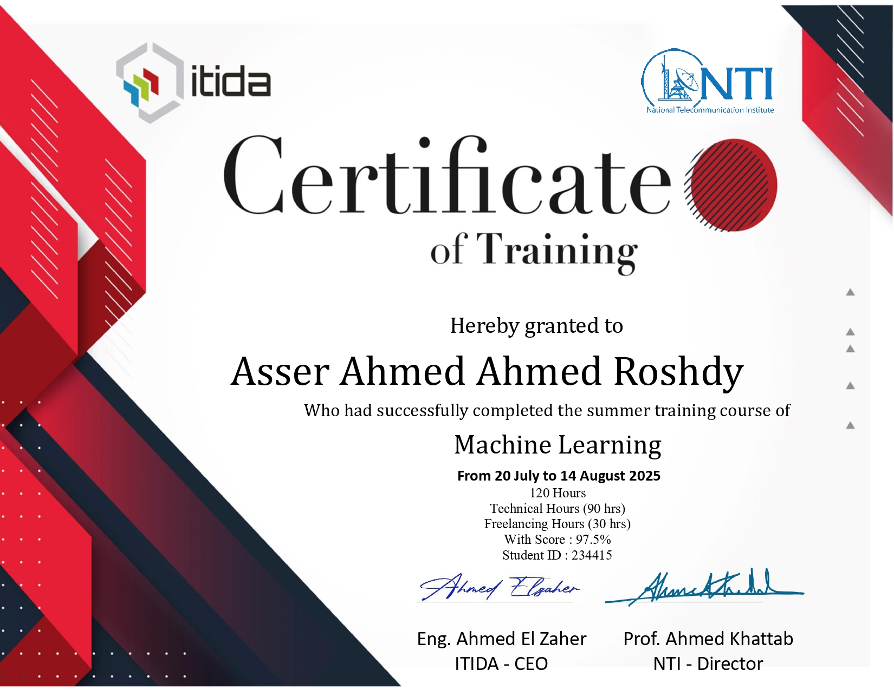

# NTI Machine Learning Internship

A collection of machine learning algorithm implementations and projects developed during the intensive 120-hour summer training at the **National Telecommunication Institute (NTI)** (July - Aug 2025).

## Projects & Implementations

| Project | Description |
| :--- | :--- |
| **[Heart Failure Predictor ](https://github.com/Asir-IO/heart-failure-predictor/tree/improved)** (`Final Project`)| Gradio ML app predicting heart failure risk.|
| **[Digit Classifier](https://github.com/Asir-IO/digit-classification/tree/main)** (`Final Project`) | Interactive MNIST digit recognizer built with TensorFlow & Gradio.|
| **[Support Vector Machines](./labs/SVM)** | Used it via sci-kit learn.|
| **[PCA](./labs/PCA)** | Implemented it from scratch. |
| **[Linear Regression](./labs/Linear-Regression)** | Used it via sci-kit learn.|
| **[Logistic Regression](./labs/Logistic-Regression)** | Used it via sci-kit learn.|
| **[Decision Trees](./labs/Decision-trees)** | Used it via sci-kit learn.|
| **[K-Means Clustering](./labs/K-Means)** | Used it via sci-kit learn.|
| **[Pandas & Data Handling](./labs/DF)** | Learnt how to do it.|

## Freelancing Track
Alongside technical training, I completed 30 hours of personal development, establishing a presence on major freelancing platforms.

* **Upwork:** [View Profile](https://www.upwork.com/freelancers/~014238b233794746df)
* **Freelance Yard:** [View Profile](https://www.freelanceyard.com/en/freelancers/asser-ahmed)
* **Khamsat:** [View Profile](https://khamsat.com/user/asserio)
* **LinkedIn:** [View Profile](https://www.linkedin.com/in/asser-ahmed-386329320/)

## Certificate

